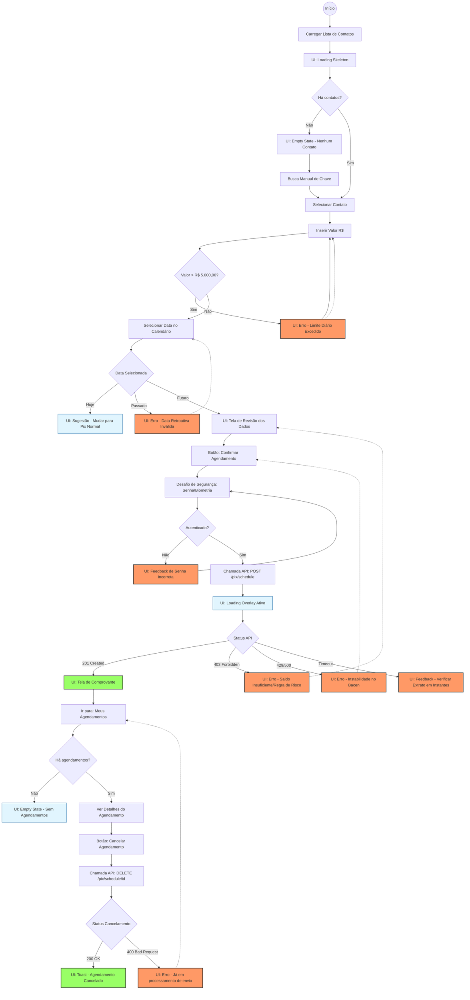

# COMANDO DE ENGENHARIA DE FLUXO

Atue como um Arquiteto de Soluções Sênior. Com base na análise de riscos e requisitos refinados que acabamos de gerar acima, crie o código para um Diagrama de Fluxo (Flowchart) utilizando a sintaxe **Mermaid.js**.

## Requisitos do Diagrama:
1. **Orientação:** Top-Down (`graph TD`).
2. **Cobertura:** Deve cobrir o "Caminho Feliz" (Sucesso) e TODOS os "Caminhos Infelizes" (Erros de API, Validação, Timeout, Falta de Saldo) identificados na análise anterior.
3. **Estados de Interface:** Represente claramente telas de *Loading*, *Empty State* e *Feedback de Erro*.
4. **Estilização Semântica:**
   - Use nós retangulares `[]` para Ações do Usuário ou Processos do Sistema.
   - Use losangos `{}` para Decisões de Lógica de Negócio (ex: "Tem saldo?", "API Online?").
   - **Importante:** Aplique estilos (classes) para diferenciar visualmente:
     - `classDef error fill:#f96,stroke:#333,stroke-width:2px;` (Para erros)
     - `classDef success fill:#9f6,stroke:#333,stroke-width:2px;` (Para sucesso)

## Saída Esperada:
Apenas o bloco de código Markdown (```mermaid```) pronto para renderização. Não inclua explicações em texto.


