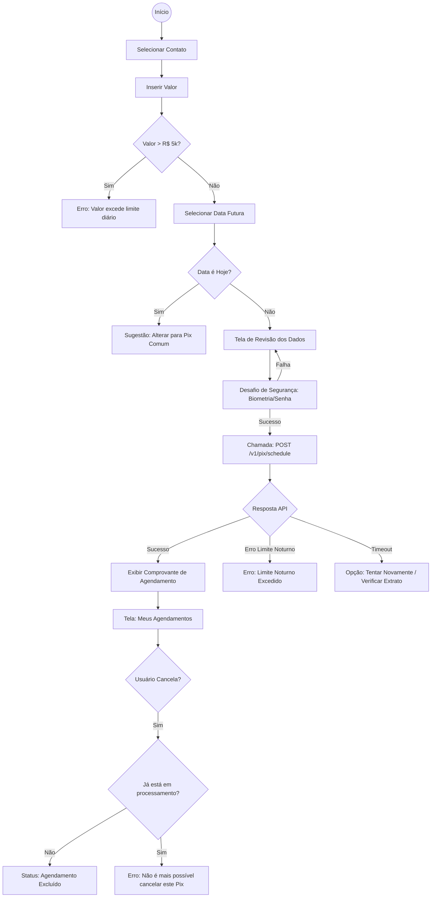

Como Arquiteto de Software e Especialista em UX, realizei uma segunda rodada de análise profunda, focando em aspectos técnicos de implementação (MFA, concorrência e limites dinâmicos) que são críticos para sistemas financeiros.

---

### 1. Análise de Risco (Pontos Cegos do Requisito)

*   **Limite Noturno (Resolução BCB):** O ticket cita um limite de R$ 5.000,00, mas ignora as regras do Banco Central para o período noturno (geralmente entre 20h e 06h), onde o limite costuma ser de R$ 1.000,00. O sistema deve validar se o agendamento fere o limite do horário em que será *executado*.
*   **Janela de Cancelamento:** Até que horas o usuário pode cancelar? (Ex: Até as 23:59 da véspera ou até o momento da liquidação no dia?). É necessário definir a trava de "Agendamento em Processamento".
*   **Desatualização de Chave:** O que acontece se a chave Pix do destinatário for excluída ou portada para outro banco entre o agendamento e a execução? A UI de agendamentos precisa de um estado de "Alerta de Chave Inválida".
*   **MFA/Segurança:** O requisito não menciona o desafio de segurança (Biometria/Senha). O agendamento é uma promessa de transferência e **deve** exigir autenticação forte no ato da criação.
*   **Concorrência de Saldo Futuro:** Se o usuário agendar 5 transferências de R$ 1.000,00 para o mesmo dia, mas só tiver R$ 1.000,00 na conta, qual critério de prioridade o motor de pagamentos usará? (Ordem cronológica de criação ou valor?).

---

### 2. Mapeamento de Estados de UI (Dev Checklist)

#### **Entrada de Dados e Validação**
*   `Date Picker Restriction`: Dias passados e o dia atual devem estar desabilitados (cinza) para evitar o erro de "Pix Normal".
*   `Amount Feedback`: Se o valor for > 5000, o botão "Continuar" deve ficar desabilitado com um `Helper Text` explicando o motivo.
*   `Insufficient Funds (Soft Warning)`: Um aviso visual se o valor agendado for maior que o saldo atual (mesmo que o Pix seja futuro, é boa prática de UX).

#### **Processamento e Segurança**
*   `Biometric/Pin Challenge`: Modal de autenticação antes da confirmação final.
*   `Processing State`: Spinner com texto "Registrando agendamento com o Banco Central...".

#### **Gestão de Agendamentos (Tela de Lista)**
*   `Empty State`: Ilustração e texto convidando o usuário a realizar o primeiro agendamento.
*   `Cancellation Loading`: Estado de loading específico no item que está sendo cancelado para evitar cliques duplos.
*   `Error State (Cancellation)`: Feedback caso o usuário tente cancelar um Pix que já entrou em processamento de liquidação.

#### **Comprovante**
*   `Print/Share State`: Versão otimizada do comprovante para captura de tela ou compartilhamento de PDF.

---

### 3. Fluxo Lógico (Mermaid.js)

### Considerações para o Desenvolvedor Front-End:
1.  **Redirecionamento Inteligente:** Se o usuário escolher "Hoje" no calendário, não apenas mostre um erro; ofereça um botão "Fazer Pix Agora" que herda o contato e o valor já preenchidos.
2.  **Acessibilidade:** Garanta que o `Date Picker` seja navegável via teclado e que leitores de tela anunciem claramente que se trata de uma transação agendada para o futuro.
3.  **Idempotência:** Garanta que o botão de confirmação envie um `x-idempotency-key` no header da API para evitar duplicidade em casos de oscilação de rede (3G/4G).